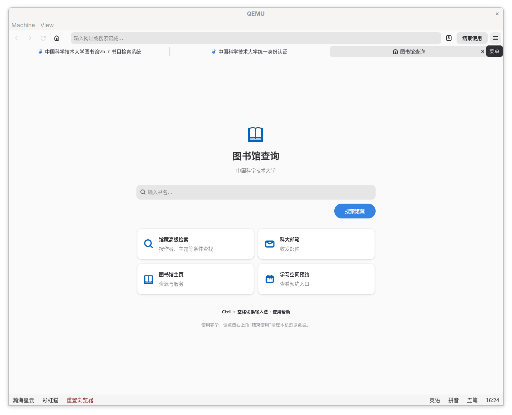

# LIIMS Browser

为科大图书馆查询机定制的简洁、美观的 WebKit 浏览器。基于 Rust + GTK4 + Libadwaita。替代原来的[魔改版 Midori](https://github.com/taoky/midori)。



## 构建与运行

需要 Rust 1.92 或更新版本、GTK 4.18+、libadwaita 1.7+、WebKitGTK 2.48+（API 6.0），以及 `blueprint-compiler`。Rust 依赖版本记录在 `Cargo.lock`。

### Arch Linux

```sh
# rust, or use rustup to install latest Rust.
sudo pacman -S --needed base-devel rust pkgconf gtk4 libadwaita webkitgtk-6.0 blueprint-compiler
cargo build --locked
cargo run --locked -- --windowed
```

### Debian 13

Debian 13 使用 `trixie-backports` 提供的 Rust 工具链（测试开发也可以用 rustup 安装最新 Rust），开发库使用稳定版仓库：

```sh
echo 'deb http://deb.debian.org/debian trixie-backports main' | sudo tee /etc/apt/sources.list.d/backports.list
sudo apt update
sudo apt install build-essential pkg-config blueprint-compiler libgtk-4-dev libadwaita-1-dev libwebkitgtk-6.0-dev
sudo apt install -t trixie-backports rustc cargo
cargo build --locked
```

也可以通过容器构建。容器以 Debian 13 为基础，同样从 backports 安装 Rust：

```sh
# 也可以用 docker
podman build -f packaging/Containerfile.debian -t liims-browser-debian .
container=$(podman create liims-browser-debian /unused)
podman cp "$container:/out" ./dist
podman rm "$container"
```

### Debian 13 DEB 软件包

以上的容器构建会自动完成 DEB 软件包的构建（需要联网下载镜像、APT 和 Cargo 依赖）。

也可以在 Debian 13 上完成上述开发环境安装后直接打包：

```sh
sudo apt install debhelper python3
make deb
```

更新版本时需同步 `Cargo.toml` 和 `debian/changelog`。

`debian/control` 声明了 Rust 1.92+ 的构建依赖，需先按上述步骤从 backports 安装。如果同时安装了 rustup，请确认 `cargo --version` 和 `rustc --version` 均不低于 1.92。

默认启动为最大化查询窗口；`--windowed` 显示常规窗口按钮。支持指定启动的 URL：`--url https://example.org`。

## 配置

配置读取顺序：`--config PATH`、`/etc/liims/browser.toml`、内置 `data/browser.toml`。显式配置读取失败或内容无效时，程序报错退出，不静默忽略错误。

校区选择顺序：`--profile NAME`、内核命令行 `profile=NAME`、`default`。支持原来的 `default` 和 `iat` 校区，不再通过 `sed` 修改配置。

```sh
target/debug/liims-browser --check-config
target/debug/liims-browser --config data/browser.toml --profile iat --windowed
```

`profiles` 定义校区名、含一个 `%s` 的馆藏搜索 URL 模板及首页入口。搜索词按 URL 查询参数编码。入口迁移自原 LIIMS 配置，实际服务的域名和路径仍由管理员维护。`site_rules` 以精确主机名和路径前缀匹配，支持 `input_hint`，以及按需启用的`disable_synthetic_bold` 字体兼容修复。

原来的输入法 JavaScript 提示改为原生提示条。不提供任意扩展或远程脚本加载机制。

## 会话与查询功能

- 首页、新标签及最后一个标签关闭后，显示原生馆藏查询首页。
- 标签总览、地址栏、页内查找、缩放、HTTP 登录和 JavaScript 对话框。
- 同一使用会话的标签共享临时 WebKit 网络会话；“回首页”保留登录信息。
- “结束使用”经确认后关闭页面及其对话框，创建新网络会话，不恢复历史标签。
- 无操作 45 秒显示提示，60 秒自动清理；用户操作取消倒计时，后台网页加载不续时。
  这只是浏览器的计时，整机重置策略保持独立。
- 用户输入及网站导航不交给外部协议处理器。内部 `about:blank` 允许用于网站弹窗。
- 禁用上传、下载、打印及网站设备权限；不保存密码，不允许跳过证书错误。

会话清理清除本机浏览状态，不等于撤销服务器会话。本应用不替代整机的网络限制、桌面快捷键限制或用户目录重置。

## 验证

```sh
cargo test --locked
cargo fmt --check
cargo clippy --locked --all-targets -- -D warnings
python3 scripts/gui-test.py
# 可选：另行探测配置中的真实站点（会访问网络，不会提交登录信息）
python3 scripts/gui-test.py --sites
```

GUI 测试在独立 D-Bus 会话中启动虚拟显示器和 Weston，并用原生 Wayland 运行 GTK/WebKit。

## 部署

`make install DESTDIR=/path/to/staging` 将程序、配置、桌面入口和用户服务安装到暂存目录。Debian 容器构建输出 `.deb` 与二进制；包将 `/etc/liims/browser.toml` 标记为配置文件。服务不会由安装脚本自动启动。

Wayland 桌面会话应导入 `WAYLAND_DISPLAY` 等环境并管理 `graphical-session.target`。部署时将原启动入口与面板的浏览器重启命令改为 `liims-browser.service`。可参考 [liimstrap](https://github.com/ustclug/liimstrap) 仓库。

## 代码结构

- `data/*.blp`：窗口、首页、卡片及对话框布局；`data/style.css` 仅补充少量视觉样式。
- `src/browser.rs`：标签生命周期、浏览器操作及会话重置。
- `src/browser/`：WebKit 接入、页面对话框与真实 WebKit 集成测试。
- `src/home.rs`：校区入口和搜索行为。
- `src/config.rs`、`navigation.rs`、`session.rs`：配置、地址解析及独立可测试的空闲状态机。

UI 由 Blueprint（而非 GTK 传统的 XML 或在 Rust 代码中直接堆）定义。
